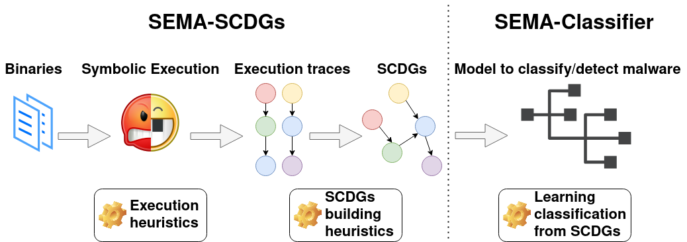

# :skull_and_crossbones: SEMA :skull_and_crossbones: - ToolChain using Symbolic Execution for Malware Analysis.

```
  ██████ ▓█████  ███▄ ▄███▓ ▄▄▄
▒██    ▒ ▓█   ▀ ▓██▒▀█▀ ██▒▒████▄
░ ▓██▄   ▒███   ▓██    ▓██░▒██  ▀█▄
  ▒   ██▒▒▓█  ▄ ▒██    ▒██ ░██▄▄▄▄██
▒██████▒▒░▒████▒▒██▒   ░██▒ ▓█   ▓██▒
▒ ▒▓▒ ▒ ░░░ ▒░ ░░ ▒░   ░  ░ ▒▒   ▓▒█░
░ ░▒  ░ ░ ░ ░  ░░  ░      ░  ▒   ▒▒ ░
░  ░  ░     ░   ░      ░     ░   ▒
      ░     ░  ░       ░         ░  ░

```


# :books:  Documentation

1. [ Architecture ](#page_with_curl-architecture)
    1. [ Toolchain architecture ](#toolchain-architecture)

2. [ Recommended installation and usage ](#page_with_curl-recommended-installation-and-usage)

3. [ Dockerhub installation and usage ](#page_with_curl-dockerhub-installation-and-usage)

4. [ Pypi installation and usage ](#page_with_curl-Pypi-installation-and-usage)

5. [ Credentials ](#page_with_curl-credentials)

:page_with_curl: Architecture
====
<a name="arch"></a>

### Toolchain architecture
<a name="arch_std"></a>

Our toolchain is represented in the next figure  and works as follow. A collection of labelled binaries of different malwares families is collected and used as the input of the toolchain. **Angr**, a framework for symbolic execution, is used to execute symbolically binaries and extract execution traces. For this purpose, different heuristics have been developped to optimize symbolic execution. Several execution traces (i.e : API calls used and their arguments) corresponding to one binary are extracted with Angr and gather together thanks to several graph heuristics to construct a SCDG. These resulting SCDGs are then used as input to graph mining to extract common graph between SCDG of the same family and create a signature. Finally when a new sample has to be classified, its SCDG is build and compared with SCDG of known families (thanks to a simple similarity metric).



This repository contains a first version of a SCDG extractor.
During symbolic analysis of a binary, all system calls and their arguments found are recorded. After some stop conditions for symbolic analysis, a graph is build as follow : Nodes are systems Calls recorded, edges show that some arguments are shared between calls.

When a new sample has to be evaluated, its SCDG is first build as described previously. Then, `gspan` is applied to extract the biggest common subgraph and a similarity score is evaluated to decide if the graph is considered as part of the family or not. The similarity score `S` between graph `G'` and `G''` is computed as follow:
Since `G''` is a subgraph of `G'`, this is calculating how much `G'` appears in `G''`.
Another classifier we use is the Support Vector Machine (`SVM`) with INRIA graph kernel or the Weisfeiler-Lehman extension graph kernel.

A web application is available and is called SemaWebApp. It allows to manage the launch of experiments on SemaSCDG and/or SemaClassifier.

#### Main depencies:

    * Python 3.8

    * Docker >=26.1.3 , docker buildx, Docker Compose >=v2.27.0

    * radare2

    * libvirt-dev, libgraphviz-dev, wheel

#### Interesting links

* https://angr.io/

* https://bazaar.abuse.ch/

* https://docs.docker.com/engine/install/ubuntu/


#### For extracting database

```bash
cd databases/Binaries; bash extract_deploy_db.sh
```

Password for archive is "infected". Warning : it contains real samples of malwares.

#### For compressing database

```bash
#To zip back the test database
cd databases/Binaries; bash compress_db.sh
```

:page_with_curl: **Recommended installation and usage**
====
<a name="install"></a>

Install the entire toolchain

```bash
# Full installation (ubuntu)
make build-toolchain;
```

## How to use ?

### Using the web application

First launch the containers :
```bash
make run-toolchain
```

It will start the scdg, the classifier and the web app services. If you wish to use only the scdg or only the classifier, refer to the next sections.

Wait for the containers to be up

Then visit 127.0.0.1:5000 on your browser

See next sections for details about the different parameters.

#### Shut down

To leave the toolchain just press Ctrl+C then use
```bash
make stop-toolchain
```
To stop all docker containers.

If you want to remove all images :

```bash
docker rmi sema-web-app
docker rmi sema-scdg
docker rmi sema-classifier
```

### Use only SemaSCDG

First run the SCDG container with volumes like this :
```bash
docker run --rm --name="sema-scdg" -v ${PWD}/OutputFolder:/sema-scdg/application/database/SCDG -v ${PWD}/ConfigFolder:/sema-scdg/application/configs -v ${PWD}/InputFolder:/sema-scdg/application/database/Binaries  -it sema-scdg bash
```
Where the first volume corresponds to the output folder where the results will be put. The second volume corresponds to the folder containing the configuration files that will be passed to the docker. And the third matches the folder containing the binaries that are going to be passed to the container.

Inside the container just run  :
```bash
python3 SemaSCDG.py configs/config.ini
```
Or if you want to use pypy3:
```bash
pypy3 SemaSCDG.py configs/config.ini
```

#### Configuration files

The parameters are put in a configuration file : `configs/config.ini`
Feel free to modify it or create new configuration files to run different experiments.

To restore the default values of `config.ini` do :
```bash
python3 restore_defaults.py
```
The default parameters are stored in the file `default_config.ini`
Do not modify `config_tutorial.ini` and `config_test.ini` as they are designed to fit the Tutorial and the tests needs respectively.

The output of the SCDG are put into `database/SCDG/runs/` by default. If you are not using volumes and want to save some runs from the container to your host machine :
```bash
make save-scdg-runs ARGS=PATH
```

#### Parameters description
SCDG module arguments

```
expl_method:
  DFS                 Depth First Search
  BFS                 Breadth First Search
  CDFS                Coverage Depth-First Search Strategy (Default)
  CBFS                Coverage Breadth First Search

graph_output:
  gs                  .GS format
  json                .JSON format
  EMPTY               if left empty then build on all available format

packing_type:
  symbion             Concolic unpacking method (linux | windows [in progress])
  unipacker           Emulation unpacking method (windows only)

SCDG exploration techniques parameters:
  jump_it              Number of iteration allowed for a symbolic loop (default : 3)
  max_in_pause_stach   Number of states allowed in pause stash (default : 200)
  max_step             Maximum number of steps allowed for a state (default : 50 000)
  max_end_state        Number of deadended state required to stop (default : 600)
  max_simul_state      Number of simultaneous states we explore with simulation manager (default : 5)

Binary parameters:
  n_args                  Number of symbolic arguments given to the binary (default : 0)
  loop_counter_concrete   How many times a loop can loop (default : 10240)
  count_block_enable      Enable the count of visited blocks and instructions
  sim_file                Create SimFile
  entry_addr              Entry address of the binary

SCDG creation parameter:
  min_size             Minimum size required for a trace to be used in SCDG (default : 3)
  disjoint_union       Do we merge traces or use disjoint union ? (default : merge)
  not_comp_args        Do we compare arguments to add new nodes when building graph ? (default : comparison enabled)
  three_edges          Do we use the three-edges strategy ? (default : False)
  not_ignore_zero      Do we ignore zero when building graph ? (default : Discard zero)
  keep_inter_SCDG      Keep intermediate SCDG in file (default : False)
  eval_time            TODO

Global parameter:
  concrete_target_is_local      Use a local GDB server instead of using cuckoo (default : False)
  print_syscall                 Print the syscall found
  csv_file                      Name of the csv to save the experiment data
  plugin_enable                 Enable the plugins set to true in the config.ini file
  approximate                   Symbolic approximation
  is_packed                     Is the binary packed ? (default : False, not yet supported)
  timeout                       Timeout in seconds before ending extraction (default : 600)
  string_resolve                Do we try to resolv references of string (default : True)
  log_level                     Level of log, can be INFO, DEBUG, WARNING, ERROR (default : INFO)
  family                        Family of the malware (default : Unknown)
  exp_dir                       Name of the directory to save SCDG extracted (default : Default)
  binary_path                   Relative path to the binary or directory (has to be in the database folder)
  fast_main                     Jump directly into the main function

Plugins:
  plugin_env_var          Enable the env_var plugin
  plugin_locale_info      Enable the locale_info plugin
  plugin_resources        Enable the resources plugin
  plugin_widechar         Enable the widechar plugin
  plugin_registery        Enable the registery plugin
  plugin_atom             Enable the atom plugin
  plugin_thread           Enable the thread plugin
  plugin_track_command    Enable the track_command plugin
  plugin_ioc_report       Enable the ioc_report plugin
  plugin_hooks            Enable the hooks plugin
```

**The binary path has to be a relative path to a binary beeing into the `database` directory**

To know the details of the angr options see [Angr documentation](https://docs.angr.io/en/latest/appendix/options.html)

You also have a script `MergeGspan.py` in `sema_scdg/application/helper` which could merge all `.gs` from a directory into only one file.

#### Run multiple experiments automatically

If you wish to run multiple experiments with different configuration files, the script `multiple_experiments.sh` is available and can be used inside the scdg container:
```bash
# To show usage
./multiple_experiments.sh -h

# Run example
./multiple_experiments.sh -m python3 -c configs/config configs/default_configs
```

#### Tests

To run the test, inside the docker container :
```bash
python3 scdg_tests.py configs/config_test.ini
```

#### Tutorial

There is a jupyter notebook providing a tutorial on how to use the scdg. To launch it, inside the docker, run
```bash
jupyter notebook --ip=0.0.0.0 --port=5001 --no-browser --allow-root --NotebookApp.token=''
```
and visit `http://127.0.0.1:5001/tree` on your browser. Go to `/Tutorial` and open the jupyter notebook.

### Use only SemaClassifier

Launch the container:
```bash
docker run --rm --name="sema-scdg" -v ${PWD}/InputFolder:/sema-classifier/application/database -it sema-classifier ../docker_startup.sh 1
```

Where the volume correspond to the folder containings the inputs that will be accessible by the container.

Then just run the script :
```
python3 SemaClassifier.py FOLDER/FILE

usage: update_readme_usage.py [-h] [--threshold THRESHOLD] [--biggest_subgraph BIGGEST_SUBGRAPH] [--support SUPPORT] [--ctimeout CTIMEOUT] [--epoch EPOCH] [--sepoch SEPOCH]
                              [--data_scale DATA_SCALE] [--vector_size VECTOR_SIZE] [--batch_size BATCH_SIZE] (--classification | --detection) (--wl | --inria | --dl | --gspan)
                              [--bancteian] [--delf] [--FeakerStealer] [--gandcrab] [--ircbot] [--lamer] [--nitol] [--RedLineStealer] [--sfone] [--sillyp2p] [--simbot]
                              [--Sodinokibi] [--sytro] [--upatre] [--wabot] [--RemcosRAT] [--verbose_classifier] [--train] [--nthread NTHREAD]
                              binaries

Classification module arguments

optional arguments:
  -h, --help            show this help message and exit
  --classification      By malware family
  --detection           Cleanware vs Malware
  --wl                  TODO
  --inria               TODO
  --dl                  TODO
  --gspan               TODOe

Global classifiers parameters:
  --threshold THRESHOLD
                        Threshold used for the classifier [0..1] (default : 0.45)

Gspan options:
  --biggest_subgraph BIGGEST_SUBGRAPH
                        Biggest subgraph consider for Gspan (default: 5)
  --support SUPPORT     Support used for the gpsan classifier [0..1] (default : 0.75)
  --ctimeout CTIMEOUT   Timeout for gspan classifier (default : 3sec)

Deep Learning options:
  --epoch EPOCH         Only for deep learning model: number of epoch (default: 5) Always 1 for FL model
  --sepoch SEPOCH       Only for deep learning model: starting epoch (default: 1)
  --data_scale DATA_SCALE
                        Only for deep learning model: data scale value (default: 0.9)
  --vector_size VECTOR_SIZE
                        Only for deep learning model: Size of the vector used (default: 4)
  --batch_size BATCH_SIZE
                        Only for deep learning model: Batch size for the model (default: 1)

Malware familly:
  --bancteian
  --delf
  --FeakerStealer
  --gandcrab
  --ircbot
  --lamer
  --nitol
  --RedLineStealer
  --sfone
  --sillyp2p
  --simbot
  --Sodinokibi
  --sytro
  --upatre
  --wabot
  --RemcosRAT

Global parameter:
  --verbose_classifier  Verbose output during train/classification (default : False)
  --train               Launch training process, else classify/detect new sample with previously computed model
  --nthread NTHREAD     Number of thread used (default: max)
  binaries              Name of the folder containing binary'signatures to analyze (Default: output/save-SCDG/, only that for ToolChain)
```

#### Example

This will train models for input dataset

```bash
python3 SemaClassifier.py --train output/save-SCDG/
```

This will classify input dataset based on previously computed models

```bash
python3 SemaClassifier.py output/test-set/
```

#### Tests

To run the classifier tests, run inside the docker container:
```bash
python3 classifier_tests.py configs/config_test.ini
```

:page_with_curl: **Dockerhub installation**
====
<a name="dockerhub"></a>

## SemaSCDG

If you only need the SCDG part of the toolchain you can use :
```bash
make pull-scdg
```
To pull the docker image directly from dockerHub. Or visit `https://hub.docker.com/repository/docker/manonoreins/sema-scdg/tags`

Then use the same commands than in the recommended usage section

## SemaClassifier

If you only need the Classifier part of the toolchain you can use :
```bash
make pull-classifier
```
To pull the docker image directly from dockerHub. Or visit `https://hub.docker.com/repository/docker/manonoreins/sema-classifier/tags`

Then use the same commands than in the recommended usage section

:page_with_curl: **Pypi installation and usage**
====
<a name="pypi"></a>

If you wish to install the toolchain python dependencies on your system, use :

```bash
pip install sema-toolchain
```

#### Pypy3 usage

By default, pypy3 can be used to launch experiments inside the SCDG's docker container. If you wish to use it outside the container, make sure to install pypy3 :

```bash
sudo add-apt-repository ppa:pypy/ppa
sudo apt update
sudo apt install pypy3
```

Then install the dependecies on pypy3 :

```bash
pypy3 -m pip install -r /sema_scdg/requirements_pypy.txt
```

:page_with_curl: Credentials
====
<a name="credit"></a>

Main authors of the projects:

* **Charles-Henry Bertrand Van Ouytsel** (UCLouvain)

* **Christophe Crochet** (UCLouvain)

* **Khanh Huu The Dam** (UCLouvain)

* **Oreins Manon** (UCLouvain)

Under the supervision and with the support of **Fabrizio Biondi** (Avast)

Under the supervision and with the support of our professor **Axel Legay** (UCLouvain) (:heart:)
